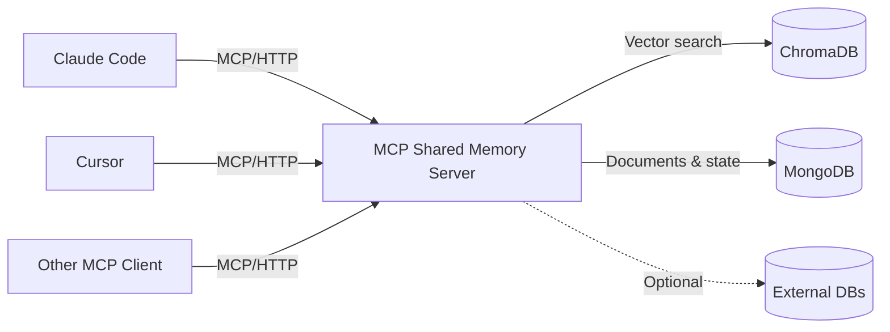

# MCP Shared Memory Server

[](https://github.com/tlemmons/mcp-shared-memory/actions/workflows/ci.yml)
[](https://opensource.org/licenses/MIT)


**A shared memory and coordination server for multiple AI coding agents, built on the Model Context Protocol (MCP).**

When you run multiple AI agents on the same codebase, three things break fast:

1. **They forget everything between sessions.** Agent parks, knowledge dies. The next agent re-reads the same code, re-discovers the same bugs, re-learns the same gotchas.
2. **They step on each other.** Two agents modify the same file. Nobody knows what anyone else is doing or has locked.
3. **They get dumber as sessions get long.** Research calls this "context rot" — model performance degrades as the context window fills up, even well below capacity. Longer sessions don't mean better work.

This server fixes all three. It gives your agents a shared brain that persists across sessions, coordinates work across agents, and lets them record what they learn so the next agent starts where the last one left off.

**Battle-tested.** This has been running in production coordinating 6 specialized agents across 500+ sessions on a commercial IoT platform — C#/.NET server, Python on Raspberry Pi, .NET MAUI mobile, MQTT, Redis, the works. The problems it solves were discovered the hard way.

---

## What It Does

- **Persistent knowledge base** -- Store architecture docs, learnings, gotchas, and code snippets that survive across sessions and are searchable via vector similarity (ChromaDB).
- **Multi-agent coordination** -- File locking, inter-agent messaging, heartbeat monitoring, and overlap detection so multiple AI agents can work on the same codebase without stepping on each other.
- **Task and backlog management** -- Track work items, assign tasks to agents, manage checklists, and hand off context between sessions.
- **Function registry with auto-enrichment** -- Register functions once, and a librarian daemon analyzes the source code to add signatures, gotchas, and semantic search summaries.

---

## How It Compares

There are 370+ MCP memory servers listed on PulseMCP. Most give a single agent persistent memory. This server is built for **teams of agents** working together on the same project over weeks and months.

| Capability | Typical MCP Memory Server | This Server |
|---|---|---|
| Persistent storage | Yes | Yes — MongoDB + ChromaDB vector search |
| Multi-agent session tracking | No | Yes — Agent registry, heartbeat, overlap detection |
| Cross-agent messaging | No | Yes — Send/receive messages with threading and status tracking |
| Function registry | No | Yes — Register once, librarian daemon auto-enriches with code analysis |
| Task backlog | No | Yes — Create tasks, assign to agents, track status and priority |
| Versioned specs & contracts | No | Yes — Owner enforcement, semver history |
| File locking | No | Yes — Atomic locks with stale detection, auto-release on session end |
| Behavioral guidelines | No | Yes — Set rules once, every agent on every machine receives them |
| Staleness management | No | Yes — Age warnings, supersede, archive, bulk cleanup by tag |
| Librarian mode | No | Yes — Agents analyze source code and enrich the knowledge base |
| External database access | No | Yes — Read-only SQL queries (MSSQL) against your project databases |
| Checklists | No | Yes — Shared launch readiness, deploy steps, etc. |

40 tools across 14 categories. Not a toy — a coordination system.

---

## Works for Solo Agents Too

You don't need multiple agents to benefit from this server. A single Claude Code or Cursor instance gets:

- **Persistent memory across sessions** — your agent remembers what it learned yesterday
- **Function registry** — the agent doesn't re-read code it already analyzed
- **Learnings** — gotchas, workarounds, and non-obvious behaviors survive session restarts
- **Librarian enrichment** — your codebase gets indexed and searchable over time
- **Backlog** — track what's done and what's next between sessions
- **State specs** — resume exactly where you left off

The coordination features (messaging, file locks, multi-agent awareness) just sit there unused. They don't hurt anything — they're tools your agent doesn't call until you scale up.

**Start with one agent. The multi-agent features are there when you're ready — they don't get in the way until you need them.**

---

## Architecture



The server runs as a single Docker Compose stack. AI agents connect over MCP (streamable HTTP transport on port 8080). All knowledge, messages, and coordination state are persisted across restarts in MongoDB and ChromaDB volumes.

---

## Quick Start

```bash
git clone https://github.com/tlemmons/mcp-shared-memory.git
cd mcp-shared-memory
cp .env.example .env
# Edit .env -- set MONGO_PASSWORD to something secure
docker compose up -d
```

The server will be available at `http://localhost:8080`. MongoDB listens on port 27018 and ChromaDB on port 8001.

Verify it is running:

```bash
curl http://localhost:8080/health
```

### Your First Session

Once connected, your agent's first interaction looks like this:

```
Agent: memory_start_session(project="my-app", claude_instance="main")
→ Returns: session ID, any prior learnings, active work, handoff notes

Agent: memory_record_learning(
    session_id="...",
    topic="postgres connection pooling",
    content="PgBouncer silently drops connections after 5 min idle.
             Must set keepalive_idle=60 in connection string or
             requests fail with 'server closed the connection unexpectedly'."
)
→ Stored. Next session, memory_start_session returns this automatically.

Agent: memory_register_function(
    session_id="...",
    name="retry_with_backoff",
    file_path="src/utils/resilience.py:42",
    purpose="Retry async calls with exponential backoff and jitter",
    gotchas="Max 5 retries. Raises RetryExhausted, not the original exception."
)
→ Registered. Any future agent asking "how do we handle retries?"
  finds this via memory_find_function.
```

Three calls. Your agent now has persistent memory, and every future session starts with context instead of a blank slate.

---

## Connecting Your AI

### Claude Code

Add to `~/.claude.json` (or your project's `.mcp.json`):

```json
{
  "mcpServers": {
    "shared-memory": {
      "type": "streamable-http",
      "url": "http://localhost:8080/mcp"
    }
  }
}
```

### Cursor

Add to `.cursor/mcp.json` in your project root:

```json
{
  "mcpServers": {
    "shared-memory": {
      "type": "streamable-http",
      "url": "http://localhost:8080/mcp"
    }
  }
}
```

### Any MCP-Compatible Client

Point your client to the MCP endpoint:

```
URL:       http://localhost:8080/mcp
Transport: Streamable HTTP (stateless)
```

**Stdio transport** is also supported for clients that prefer it. Pass `--transport stdio` when starting the server:

```bash
# From the project root:
python server.py --transport stdio

# Or as a module (from the src/ directory):
python -m shared_memory --transport stdio
```

Example MCP client config for stdio mode:

```json
{
  "mcpServers": {
    "shared-memory": {
      "type": "stdio",
      "command": "python",
      "args": ["-m", "shared_memory", "--transport", "stdio"],
      "cwd": "/path/to/mcp-shared-memory/src"
    }
  }
}
```

No API keys or authentication tokens are required for local use (see [Security](#security) for remote deployments).

---

## Tool Reference

40 tools organized into 14 categories.

### Session Management (2)

| Tool | Description |
|------|-------------|
| `memory_start_session` | Register a session and receive context: recent learnings, active agents, file locks, pending signals. Call this first. |
| `memory_end_session` | Record a summary, files modified, and handoff notes. Releases all locks. Call this when done. |

### Knowledge Base (4)

| Tool | Description |
|------|-------------|
| `memory_query` | Search the knowledge base by natural language. Returns relevant docs with relevance scores. |
| `memory_get_by_id` | Retrieve a specific document by its exact ID. |
| `memory_store` | Store a new document (architecture, API spec, code snippet, interface contract, etc.). |
| `memory_record_learning` | Quick shortcut to record a learning, gotcha, or technique for other agents. |

### Search and Discovery (2)

| Tool | Description |
|------|-------------|
| `memory_search_global` | Search across all projects and shared collections at once. |
| `memory_list_projects` | List all projects with document counts. No session required. |

### File Locking (3)

| Tool | Description |
|------|-------------|
| `memory_lock_files` | Atomically lock files for exclusive editing. Supports directory locks. Auto-releases on session end. |
| `memory_unlock_files` | Release specific file locks or all locks held by your session. |
| `memory_get_locks` | View current file locks with stale detection (inactive > 30 min). |

### Backlog Management (4)

| Tool | Description |
|------|-------------|
| `memory_add_backlog_item` | Add a task, feature request, or tech debt item to the backlog. |
| `memory_list_backlog` | List backlog items with filters: project, status, priority, assignee, milestone. |
| `memory_update_backlog_item` | Update a backlog item's status, priority, assignee, or description. |
| `memory_complete_backlog_item` | Mark a backlog item as done or won't-do, with optional resolution notes. |

### Inter-Agent Messaging (7)

| Tool | Description |
|------|-------------|
| `memory_send_message` | Send a message to another agent. Supports categories (task, question, blocker, etc.) and threading. |
| `memory_get_messages` | Get pending messages for your agent. Scoped by project. |
| `memory_acknowledge_message` | Mark a message as received (shortcut for status update). |
| `memory_update_message_status` | Track message lifecycle: pending, delivered, received, completed, failed. |
| `memory_heartbeat` | Send a heartbeat with your current status (idle, busy, error). Enables stale detection. |
| `memory_get_agent_status` | Get heartbeat status of agents. Flags agents stale after 5 minutes. |
| `memory_list_agents` | Discover registered agents across projects with roles and last activity. |

### Function Registry (5)

| Tool | Description |
|------|-------------|
| `memory_register_function` | Register a function reference with name, file, purpose, and optional gotchas. Triggers librarian enrichment. |
| `memory_find_function` | Search for functions by purpose or name. Check before implementing to avoid duplication. |
| `memory_enrich_function` | Add deep analysis to a function ref: signature, parameters, side effects, complexity. For librarian use. |
| `memory_get_enrichment_queue` | View functions awaiting librarian enrichment. |
| `memory_become_librarian` | Get a prompt and unenriched functions to run local enrichment on your machine. |

### Spec Management (3)

| Tool | Description |
|------|-------------|
| `memory_define_spec` | Create or update a versioned spec with owner-only enforcement. Supports semver and history. |
| `memory_get_spec` | Retrieve a spec by name, optionally at a specific historical version. |
| `memory_list_specs` | List all specs with optional version history and type filtering. |

### Project Registry (1 CRUD tool)

| Tool | Description |
|------|-------------|
| `memory_project` | Manage projects and agents. Actions: `create`, `get`, `list`, `delete`, `add_agent`, `remove_agent`, `update_agent`. |

### Checklists (1 CRUD tool)

| Tool | Description |
|------|-------------|
| `memory_checklist` | Shared checklists for launch readiness, deploy steps, etc. Actions: `create`, `get`, `add`, `check`, `delete`, `list`. |

### External Database Queries (1 CRUD tool)

| Tool | Description |
|------|-------------|
| `memory_db` | Read-only queries against registered external databases. Actions: `list`, `schema`, `query`. SQL injection protection built in. |

### Server-Managed Guidelines (1)

| Tool | Description |
|------|-------------|
| `memory_guidelines` | Manage behavioral rules that all agents receive at session start. Actions: `list`, `set`, `delete`, `get`. Update once, every agent on every machine picks it up. |

### Admin (1 CRUD tool)

| Tool | Description |
|------|-------------|
| `memory_admin` | Manage API keys and view audit logs. Actions: `create_key`, `revoke_key`, `list_keys`, `audit_log`, `auth_status`. Requires owner role when auth is enabled. |

### Document Lifecycle (4)

| Tool | Description |
|------|-------------|
| `memory_update_work` | Update your current work status and files touched. Enables overlap detection and dependency signaling. |
| `memory_change_status` | Change a document's status: active, deprecated, superseded, archived. Preserves history. |
| `memory_archive_by_tag` | Bulk archive all documents matching a tag (e.g., end-of-version cleanup). |
| `memory_restore_by_tag` | Bulk restore previously archived documents by tag. |

---

## Configuration

All configuration is via environment variables. See `.env.example` for the complete reference.

### Required Variables

| Variable | Default | Description |
|----------|---------|-------------|
| `MONGO_PASSWORD` | `changeme` | MongoDB root password. Change this. |
| `MONGO_USER` | `mcp_orch` | MongoDB username. |
| `MONGO_DB` | `mcp_orchestrator` | MongoDB database name. |
| `MONGO_HOST` | `localhost` | MongoDB host (set automatically in Docker Compose). |
| `MONGO_PORT` | `27018` | MongoDB external port. |
| `CHROMA_HOST` | `localhost` | ChromaDB host (set automatically in Docker Compose). |
| `CHROMA_PORT` | `8001` | ChromaDB external port. |

### Optional Variables

| Variable | Default | Description |
|----------|---------|-------------|
| `MCP_AUTH_ENABLED` | `false` | Enable API key authentication. When true, `memory_start_session` requires a valid `api_key`. |
| `ANTHROPIC_API_KEY` | -- | Required only for the standalone librarian enrichment service. |
| `LIBRARIAN_PROJECT_ROOTS` | -- | JSON map of project names to filesystem paths for librarian code analysis. |
| `DB_<NAME>_TYPE` | -- | Register an external database. Supported: `mssql`. See `.env.example` for full pattern. |
| `DB_<NAME>_HOST` | -- | External database hostname. |
| `DB_<NAME>_PORT` | `1433` | External database port. |
| `DB_<NAME>_NAME` | -- | External database name. |
| `DB_<NAME>_USER` | -- | External database username. |
| `DB_<NAME>_PASS` | -- | External database password. |
| `DB_<NAME>_READONLY` | `true` | Enforce read-only queries. |
| `DB_<NAME>_TIMEOUT` | `30` | Query timeout in seconds. |
| `DB_<NAME>_MAX_ROWS` | `500` | Maximum rows returned per query. |

---

## Project Structure

```
mcp-shared-memory/
├── server.py                     # Entry point (imports from package)
├── src/
│   └── shared_memory/
│       ├── __init__.py
│       ├── __main__.py           # CLI argument parsing
│       ├── app.py                # FastMCP server instance
│       ├── config.py             # All configuration and constants
│       ├── clients.py            # MongoDB and ChromaDB client setup
│       ├── state.py              # In-memory state (sessions, locks, signals)
│       ├── helpers.py            # Shared utility functions
│       ├── auth.py               # API key auth, RBAC, tenant isolation
│       ├── audit.py              # Audit logging to MongoDB
│       └── tools/
│           ├── __init__.py       # Tool registration
│           ├── sessions.py       # Session start/end
│           ├── query.py          # Knowledge base queries
│           ├── storage.py        # Document storage and learnings
│           ├── search.py         # Cross-project search, list projects
│           ├── locking.py        # File lock management
│           ├── backlog.py        # Backlog/task management
│           ├── messaging.py      # Inter-agent messaging and status
│           ├── functions.py      # Function registry and enrichment
│           ├── specs.py          # Versioned spec management
│           ├── projects.py       # Project and agent registry
│           ├── checklists.py     # Shared checklists
│           ├── database.py       # External database queries
│           ├── lifecycle.py      # Document lifecycle and work status
│           └── admin.py          # API key management and audit logs
├── librarian.py                  # Standalone enrichment daemon (uses Haiku)
├── docker-compose.yml            # Full stack: server + MongoDB + ChromaDB
├── Dockerfile
├── requirements.txt
├── .env.example
└── LICENSE
```

---

## Development

### Prerequisites

- Python 3.11+
- Docker and Docker Compose (for MongoDB and ChromaDB)

### Running Locally

Start the backing services:

```bash
docker compose up -d mongodb chromadb
```

Install Python dependencies:

```bash
pip install -r requirements.txt
```

Run the server directly:

```bash
python server.py --host 0.0.0.0 --port 8080
```

Or as a module:

```bash
cd src && python -m shared_memory --host 0.0.0.0 --port 8080
```

### Running with Docker Compose (full stack)

```bash
docker compose up -d
```

This starts all three services (MCP server, MongoDB, ChromaDB) with health checks and automatic restarts.

### Viewing Logs

```bash
# All services
docker compose logs -f

# Just the MCP server
docker compose logs -f mcp-server
```

---

## Security

This server is designed for **local or trusted-network use**. Authentication is optional but available.

### Built-in API Key Authentication

Set `MCP_AUTH_ENABLED=true` in `.env` to require API keys for all sessions. Keys are managed via the `memory_admin` tool with role-based access control:

| Role | Access |
|------|--------|
| `owner` | Full access — manage API keys, guidelines, all projects |
| `admin` | Manage backlog, specs, functions, messaging across all projects |
| `agent` | Standard agent access, scoped to assigned projects |
| `readonly` | Query and search only, no writes |

Each API key can be scoped to specific projects for **tenant isolation** — agents only see data in their allowed projects. All security-sensitive operations are written to an **audit log** (90-day retention).

When auth is disabled (default), all tools are open — suitable for local single-user setups.

### Network Security

**If you need remote access**, do not expose port 8080 directly. Instead:

- **Tailscale / WireGuard** — Put the server on a private mesh network. This is the simplest and most secure option.
- **Reverse proxy with auth** — Use nginx or Caddy with HTTP basic auth, mTLS, or OAuth2 in front of the server.
- **SSH tunnel** — `ssh -L 8080:localhost:8080 your-server` for ad-hoc remote access.

The `MONGO_PASSWORD` in `.env.example` defaults to `changeme`. The server will start with this value, but **you must change it** for any non-throwaway deployment. MongoDB and ChromaDB ports are also exposed by default in Docker Compose — restrict these with firewall rules if your machine is network-accessible.

---

## CLAUDE.md Files

These are instruction files for [Claude Code](https://docs.anthropic.com/en/docs/claude-code). If you don't use Claude Code, you can safely ignore them.

- **`GLOBAL_CLAUDE.md.example`** — Copy to `~/.claude/CLAUDE.md` on every machine. This is the minimal bootstrap that tells Claude to start sessions and follow server-managed guidelines.
- **`CLAUDE.md.template`** — Copy into each project directory and customize with your project name, agent names, and key files.
- **`CLAUDE.md`** — This project's own Claude Code config (for developing the server itself).

**Behavioral rules are managed server-side**, not in these files. Use `memory_guidelines(action="set", ...)` to add or update rules — every agent on every machine picks them up automatically at their next session start.

---

## The Agent Discipline Problem

Having a shared memory server isn't enough. **Agents need to actually use it consistently.**

Agents drift. They forget to call `memory_record_learning`. They dump everything into one giant state spec instead of topic-scoped memories. They write to local files that other agents can't see. They run marathon sessions until context rot makes them forget their own instructions.

This server includes tools to fight that drift:

### Server-managed guidelines

Set rules once via `memory_guidelines`, every agent receives them at session start. Rules like "never write to local files," "record learnings immediately," "park after 1-3 tasks." Update once — every agent on every machine picks it up on their next `memory_start_session`.

### Staleness management

Every `memory_query` result includes age warnings. Agents are instructed to supersede outdated information as they encounter it — distributed cleanup during normal work, not a separate chore. Bulk archive completed features with `memory_archive_by_tag`.

See [docs/WORKED_EXAMPLE.md](docs/WORKED_EXAMPLE.md) for a walkthrough of two agents coordinating on a real task.

---

## Roadmap

Contributions welcome! These are known gaps that would benefit the project:

- ~~**Authentication and tenant isolation**~~ — Done! API keys with RBAC and project scoping. See [Security](#security).
- **PostgreSQL and MySQL support** — the `memory_db` tool currently supports MSSQL only
- **Local model support for librarian** — Ollama integration so the enrichment daemon doesn't require a cloud API key
- **TTL and stale data cleanup** — background pruning of expired sessions, locks, and messages with configurable retention
- **Data export/backup tooling** — dump and restore scripts for migration and disaster recovery

See [docs/WORKED_EXAMPLE.md](docs/WORKED_EXAMPLE.md) for an end-to-end walkthrough of multi-agent coordination.

---

## Hosted Version

Don't want to run your own server? A hosted version is available — you get a dedicated instance with MongoDB and ChromaDB, just point your agents at the URL and go.

- No server setup — connect your agents in minutes
- Automatic backups
- Same 40 tools, same features
- Multi-project isolation

**Interested?** Open an issue or reach out for details.

---

## License

See [LICENSE](LICENSE) for the full text.

Copyright (c) 2024-2026 Thomas Lemmons.

---

## Contributing

Contributions welcome. Please open an issue to discuss significant changes before submitting a pull request. The project uses standard Python tooling — no special build system or test framework required beyond the dependencies in `requirements.txt`.

If you're running multi-agent setups and have coordination patterns that work, I'd love to hear about them.

---

**If this project saves you time, consider [sponsoring](https://github.com/sponsors/tlemmons) the development.**
